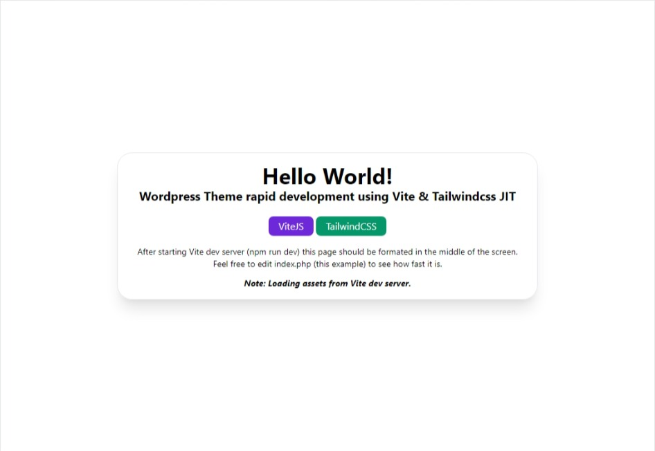

# Boilerplate Wordpress Theme with Tailwindcss & Vite

Example of using Vite + TailwindCSS in Wordpress Theme development. Auto generating CSS, auto refresh on every file save/edit and easy production build tool with no hassle.
Inspired by https://github.com/vitejs/vite/issues/341



## Main features

- fast Auto browser refresh/sync file change/save
- built in Tailwindcss Just-in-time compiler
- extremely small CSS as there is no unsued css at all
- keep your local domain while developing
- `npm run build` for production packing Javascript and CSS

## Installation (Node.js/npm required):

Clone or Unpack and copy folder to your Wordpress installation /wp-content/themes/ folder, or install theme via wp-admin by uploading .zip file and activate the theme.
Then from your console or command prompt go to the theme folder and run **npm install**. Note: NodeJS is requred.

```bash
npm install
```

Quick commands:
```bash
# dev server start
npm run dev

# production build
npm run build
```

## Setup

Entry point file **main.js** is where you include all your scripts and styles. It can be changed via **vite.config.json** and **functions.php**.

```bash
# get styles
import "./assets/css/styles.css"

# get scripts
import "./assets/js/scripts.js"
```

## Development with live preview/refresh

Ensure **define("IS_VITE_DEVELOPMENT", true);** exists in your **wp-config.php** or theme/plugin **functions.php**. Just run **npm run dev** and refresh your development website.

```bash
npm run dev
```
After Vite dev server is started open your installed Wordpress website in any browser or refresh it. Then you can start editing index.php, or any other php file in your theme, by adding elements and Tailwind classes. After saving changes your browser page eg your site should refresh immediately. You can freely edit asset files like styles.css, scripts.js too.


## Production build

Just run **npm run build**, set defined **IS_VITE_DEVELOPMENT** to **false** and refresh local website.

```bash
npm run build
```
Wordpress should load now production generated assets.

Note: To ensure classes used inside CMS to be processed just add them to safelist.txt and run build again.


## Sass / Less

CSS Pre-processors are also supported by ViteJS

```bash
# .scss and .sass
npm add -D sass

# .less
npm add -D less
```

Please check link for details.
https://vitejs.dev/guide/features#css-pre-processors


## Note for httpS serving
If your local development domain is served via **https**:// then generating certificate for localhost usage and some changes in config are required
- install mkcert utility and follow the instructions how to generate & install certificate https://github.com/FiloSottile/mkcert
    - example on Windows 10 (PowerShell as Administrator)

```bash
# install mkcert
choco install mkcert

# global one time install
mkcert -install

# run in project/theme folder to create localhost-key.pem & localhost.pem 
mkcert localhost
```

- enable server.https option in **vite.config.js**
- change VITE_SERVER to http**s** in your **inc/inc.vite.php**


## Customizations

More info on the links below
- https://vitejs.dev/config/
- https://tailwindcss.com/

Visual Studio Code Tailwind Intellisense plugin is a must.
https://marketplace.visualstudio.com/items?itemName=bradlc.vscode-tailwindcss

---
That's it.

Happy coding! :)

---
## Change log

### v0.4.1
- Package updates:
  - autoprefixer              ^10.4.13   →   ^10.4.14 
  - postcss                    ^8.4.20   →    ^8.4.21 
  - postcss-nested              ^6.0.0   →     ^6.0.1 
  - tailwindcss                 ^3.2.4   →     ^3.3.1 
  - vite                        ^4.0.1   →     ^4.2.1
  - vite-plugin-live-reload     ^3.0.1   →     ^3.0.2

### v0.4
- Package updates:
  - vite             ^3.1.8   →     ^4.0.1
  - autoprefixer   ^10.4.12   →   ^10.4.13
  - postcss         ^8.4.18   →    ^8.4.20
  - tailwindcss      ^3.2.1   →     ^3.2.4

### v0.3.6
- Package updates:
  - tailwindcss               ^3.1.8    →     ^3.2.1 

### v0.3.5
- Package updates:
  - autoprefixer              ^10.4.11   →   ^10.4.12
  - postcss                    ^8.4.16   →    ^8.4.18
  - postcss-nested              ^5.0.6   →     ^6.0.0
  - vite                        ^3.1.3   →     ^3.1.8
  - vite-plugin-live-reload     ^3.0.0   →     ^3.0.1
- ABSPATH security check added
- saflist.txt watch added

### v0.3.4
- Package updates:
  - autoprefixer              ^10.4.7   →   ^10.4.11 
  - postcss                   ^8.4.14   →    ^8.4.16 
  - tailwindcss               ^3.0.24   →     ^3.1.8 
  - vite                       ^2.9.9   →     ^3.1.3 
  - vite-plugin-live-reload    ^2.1.0   →     ^3.0.0

### v0.3.3
- Package updates:
  - autoprefixer   ^10.4.4   →   ^10.4.**7**
  - postcss        ^8.4.12   →   ^8.4.14
  - tailwindcss    ^3.0.23   →   ^3.0.24
  - vite            ^2.9.1   →    ^2.9.9

### v0.3.2
- Refresh speed improved (file search pattern fixed in tailwind.config.js)
- Package name changed
- Vite script loading logic moved to inc/inc.vite.php
- Homepage updated
- Hashed assets filenames on build, force reload not needed

### v0.3.1
- Demo layout updated
- Hello World preview image replaced
- Package updates:
    - postcss           ^8.4.7   →   ^8.4.12
    - autoprefixer     ^10.4.2   →   ^10.4.4
    - vite              ^2.8.6   →   ^2.9.1

### v0.3.0
- Tailwindcss 3 config fixes

Packages updates:
- autoprefixer     ^10.2.5   →   ^10.4.2
- postcss          ^8.2.14   →    ^8.4.7
- postcss-nested    ^5.0.5   →    ^5.0.6
- tailwindcss       ^2.1.2   →   ^3.0.23
- vite              ^2.2.4   →    ^2.8.6

### v0.2.7
- Tailwind updated to 2.2.16
- PostCSS updated to v8.3.8
- Autoprefixer updated to 10.3.6
- Vite updated to v2.6.2

### v0.2.6
- Tailwind updated to 2.2.15
- Vite updated to v2.5.7
- Autoprefixer updated to 10.3.4
- PostCSS updated to v8.3.6
- PostCSS-Nested updated to 5.0.6
- IS_VITE_DEVELOPMENT check fix

### v0.2.5
- PostCSS updated to v8.2.14

### v0.2.4
- https solution added
- 404.php template file added

### v0.2.3
- Vite updated to v2.2.4
- PostCSS updated to v8.2.13
- Tailwindcss updated to v2.1.2
- https option included into server vite.config.js

### v0.2.2
- small workaround added in order Tailwindcss Intellisense to work
- postcss package updated to v8.2.10
- index.php splited into header.php & footer.php
- example page.php template with responsive container added

### v0.2.1
- TailwindCSS updated to 2.1.1 (JIT is included in this version)
- experimental @tailwindcss/jit removed
- functions.php cleanup
- tailwind.config.js, mode 'JIT' added (v2.1.1)
- postcss.config.js updated

### v0.1.0
- initial release
